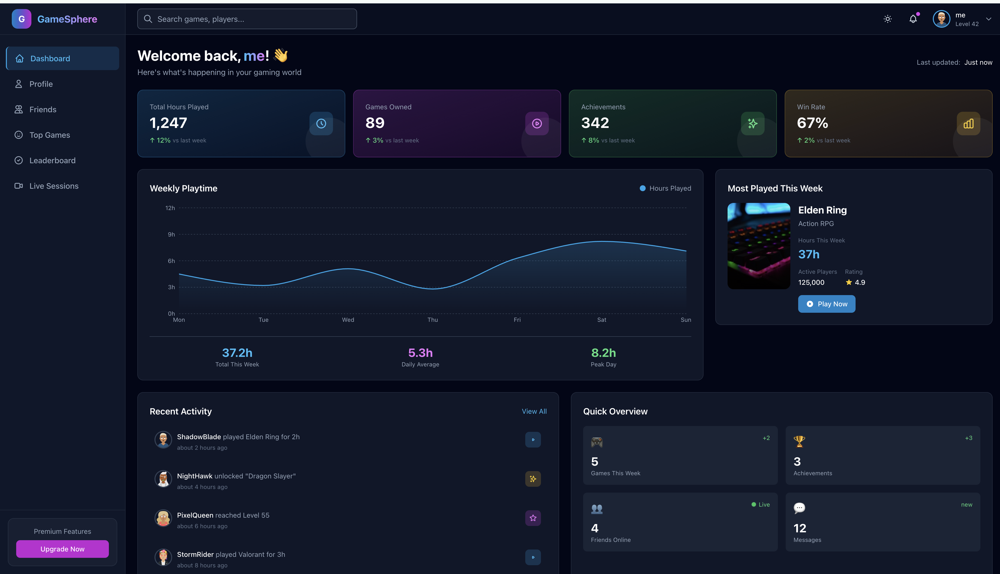

# GameSphere – Social Game Player Dashboard

A modern, feature-rich social gaming dashboard built with React, TypeScript, Tailwind CSS, and AWS AppSync GraphQL.



## 🎮 Features

### Core Pages
- **Dashboard** - Overview of your gaming stats, recent activity, and performance trends
- **Player Profile** - Detailed player statistics, game history, and achievement showcase
- **Friends Hub** - Manage friends, see their activity, and discover who's online
- **Top Games** - Browse and discover popular games with filtering and sorting
- **Leaderboard** - Global and friend rankings with multiple metrics
- **Live Sessions** - Real-time view of who's currently playing

### Technical Features
- 🌙 **Dark/Light Mode** - Toggle between themes with persistence
- ⚡ **Real-time Updates** - Live data via GraphQL subscriptions
- 📱 **Responsive Design** - Works seamlessly on desktop and mobile
- 🔐 **Authentication** - Secure login with AWS Cognito
- 📊 **Interactive Charts** - Performance visualization with Recharts
- 💀 **Skeleton Loaders** - Smooth loading states throughout
- 🎨 **Custom Animations** - Polished UI with subtle animations

## 🚀 Getting Started

### Prerequisites
- Node.js 18+ 
- npm or yarn
- AWS Account (for production deployment)

### Installation

1. **Clone the repository**
   ```bash
   cd gamesphere
   ```

2. **Install dependencies**
   ```bash
   npm install
   ```

3. **Set up environment variables**
   ```bash
   cp .env.example .env
   ```
   Edit `.env` with your AWS configuration (or use mock data for development).

4. **Start the development server**
   ```bash
   npm run dev
   ```

5. **Open your browser**
   Navigate to `http://localhost:3000`

### Development Mode
The app runs with mock data by default, so you can explore all features without AWS configuration.

## 🏗️ Project Structure

```
gamesphere/
├── src/
│   ├── components/
│   │   ├── auth/          # Authentication components
│   │   ├── common/        # Reusable UI components
│   │   ├── dashboard/     # Dashboard-specific components
│   │   ├── friends/       # Friends hub components
│   │   ├── games/         # Games browser components
│   │   ├── layout/        # Layout components (Header, Sidebar)
│   │   ├── leaderboard/   # Leaderboard components
│   │   ├── live/          # Live sessions components
│   │   └── profile/       # Profile page components
│   ├── config/            # App configuration
│   ├── context/           # React Context providers
│   ├── data/              # Mock data for development
│   ├── graphql/           # GraphQL queries, mutations, subscriptions
│   ├── hooks/             # Custom React hooks
│   ├── layouts/           # Page layouts
│   ├── pages/             # Page components
│   ├── types/             # TypeScript type definitions
│   ├── App.tsx            # Main app component with routing
│   ├── index.css          # Global styles and Tailwind
│   └── main.tsx           # App entry point
├── index.html
├── package.json
├── tailwind.config.js
├── tsconfig.json
└── vite.config.ts
```

## 🎨 Tech Stack

| Technology | Purpose |
|------------|---------|
| React 18 | UI Framework |
| TypeScript | Type Safety |
| Vite | Build Tool |
| Tailwind CSS | Styling |
| AWS Amplify | Backend Services |
| AWS AppSync | GraphQL API |
| AWS Cognito | Authentication |
| Recharts | Data Visualization |
| React Router | Client Routing |
| date-fns | Date Formatting |

## 📦 Available Scripts

| Command | Description |
|---------|-------------|
| `npm run dev` | Start development server |
| `npm run build` | Build for production |
| `npm run preview` | Preview production build |
| `npm run lint` | Run ESLint |

## 🔧 Configuration

### Environment Variables

Create a `.env` file with the following variables:

```env
VITE_AWS_REGION=us-east-1
VITE_AWS_USER_POOL_ID=your-user-pool-id
VITE_AWS_USER_POOL_CLIENT_ID=your-client-id
VITE_AWS_APPSYNC_ENDPOINT=https://your-api.appsync-api.region.amazonaws.com/graphql
VITE_AWS_APPSYNC_API_KEY=your-api-key
```

### AWS AppSync Setup

1. Create an AppSync API in AWS Console
2. Define your GraphQL schema (see `src/graphql/` for operations)
3. Set up resolvers for each operation
4. Configure authentication with Cognito

## 🎯 Key Components

### Dashboard Components
- `StatsSummaryCard` - Displays individual stats with trends
- `StatsGrid` - Grid layout for multiple stats
- `RecentActivityFeed` - Timeline of recent activities
- `TopGameHighlight` - Featured game spotlight
- `PerformanceTrendChart` - Weekly playtime visualization

### Common Components
- `Skeleton` - Loading state placeholders
- `Modal` - Reusable modal dialog
- `Badge` - Status and rank badges
- `Avatar` - User avatar with online status

### Hooks
- `useUserStats` - Fetch user statistics
- `usePlayerProfile` - Manage player profile
- `useFriends` - Friends list with real-time updates
- `useTopGames` - Games with filtering
- `useLeaderboard` - Ranked player data
- `useLiveSessions` - Real-time gaming sessions

## 🌈 Theming

The app uses a custom Tailwind theme with:
- **Primary**: Blue gradient (#3B82F6 → #2563EB)
- **Accent**: Purple gradient (#8B5CF6 → #7C3AED)
- **Dark palette**: Custom dark mode colors
- **Animations**: fade-in, slide-up, pulse-slow

## 📱 Responsive Design

- **Mobile**: Single column, collapsible sidebar
- **Tablet**: Two column layouts
- **Desktop**: Full multi-column layouts with sidebar

## 🔐 Authentication Flow

1. User visits any protected route
2. Redirected to `/login` if not authenticated
3. Login/signup with email and password
4. AWS Cognito handles authentication
5. User redirected back to original destination

## 🚀 Deployment

### Build for Production
```bash
npm run build
```

### Deploy to AWS Amplify
```bash
amplify publish
```

## 📄 License

MIT License - feel free to use this project for your own purposes.

