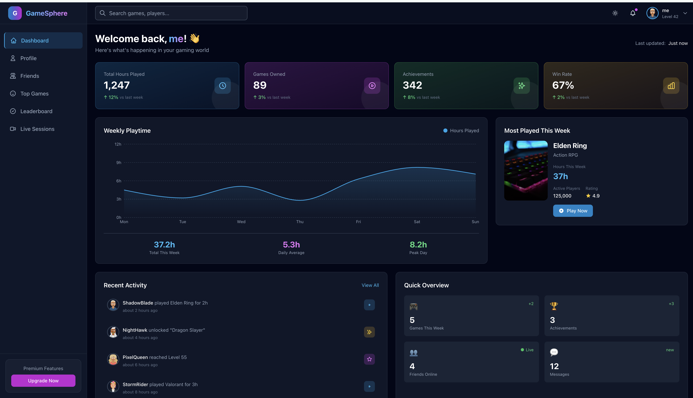

# GameSphere

Social gaming dashboard built with React, TypeScript, Vite, and AWS Amplify Gen 2.



## Overview

GameSphere provides a multi-page experience for player analytics and social gameplay:

- Dashboard with stats summary, trends, and recent activity
- Player profiles with achievements and per-game stats
- Friends page and live session visibility
- Top games and leaderboard views
- Cognito-backed authentication with protected routes

## Tech Stack

- React 18 + TypeScript
- Vite 7
- Tailwind CSS 4
- AWS Amplify Gen 2 (`auth` + `data`)
- Amazon Cognito (user authentication)
- Amplify Data client (`aws-amplify/data`)
- TanStack Query + Recharts

## Prerequisites

- Node.js `>= 20.20.0`
- npm `>= 10.8.0`
- AWS credentials configured locally (for sandbox and seed scripts)

## Quick Start

1. Install dependencies:

```bash
npm install
```

2. Start Amplify sandbox (creates backend resources and generates `amplify_outputs.json` in the repo root):

```bash
npm run amp:sandbox
```

3. In another terminal, run the app:

```bash
npm run dev
```

4. Open the local URL printed by Vite (typically `http://localhost:5173`).

## Scripts

| Command | Description |
|---|---|
| `npm run dev` | Start Vite dev server |
| `npm run build` | Type-check and create production build |
| `npm run preview` | Preview production build locally |
| `npm run lint` | Run ESLint |
| `npm run amp:sandbox` | Start Amplify Gen 2 sandbox |
| `npm run amp:sandbox:delete` | Delete Amplify sandbox resources |
| `npm run seed:users` | Create Cognito seed users |
| `npm run seed:users:delete` | Delete Cognito seed users |
| `npm run seed:data` | Seed DynamoDB data for app models |
| `npm run seed:data:delete` | Delete previously seeded DynamoDB data |

## Seeding Test Data

Run these after sandbox is up and `amplify_outputs.json` exists.

1. Create Cognito users:

```bash
npm run seed:users
```

2. Seed DynamoDB model data:

```bash
npm run seed:data
```

Optional cleanup:

```bash
npm run seed:data:delete
npm run seed:users:delete
```

Default seeded login credentials:

- `test@test.com` / `Qwer!234`
- `friend01@test.com` / `Qwer!234`
- `friend02@test.com` / `Qwer!234`

## Environment Notes

- The app reads `VITE_APP_ENV` (`development` or `production`) from Vite env.
- If not set, it defaults to `development` in local dev and `production` in production builds.
- Amplify client configuration is loaded from generated `amplify_outputs.json`.

## Backend Model (Amplify Gen 2)

Defined in `amplify/data/resource.ts` and includes:

- `User`, `PlayerStats`, `Activity`, `GameStats`, `Achievement`
- `Friendship`, `LeaderboardEntry`, `LiveSession`
- `ChatRoom`, `ChatMessage`, `Game`

Authentication is email-based Cognito auth from `amplify/auth/resource.ts`.

## Project Layout

```text
.
|- amplify/                # Amplify Gen 2 backend definition
|- docs/                   # Project images and documentation assets
|- scripts/                # Cognito and DynamoDB seeding scripts
|- src/
|  |- components/          # UI components grouped by feature
|  |- context/             # Theme and user context providers
|  |- hooks/               # Data-fetching and view-model hooks
|  |- layouts/             # Route-level layout components
|  |- pages/               # App pages (dashboard, profile, etc.)
|  |- config/              # Runtime environment + Amplify client setup
|  |- types/               # Shared TypeScript types
|- amplify.yml             # AWS Amplify CI/CD build config
```

## Deployment

The repo includes `amplify.yml` configured for AWS Amplify Hosting CI/CD:

- Backend deploy: `npx ampx pipeline-deploy --branch $AWS_BRANCH --app-id $AWS_APP_ID`
- Frontend build: `npm run build`

## License

MIT

